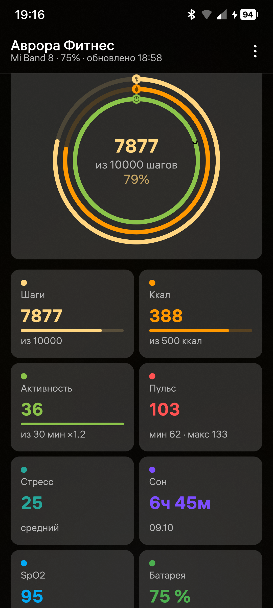
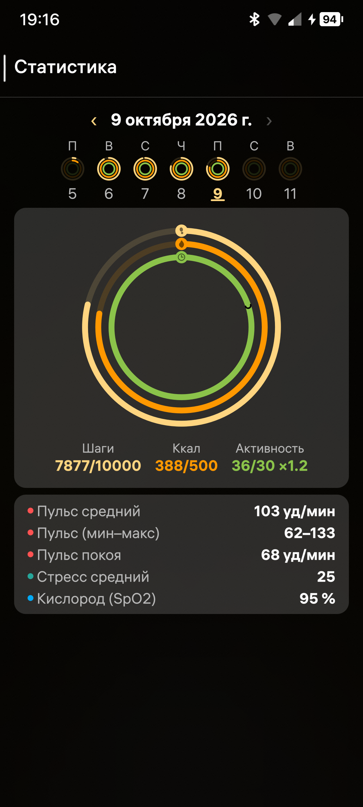
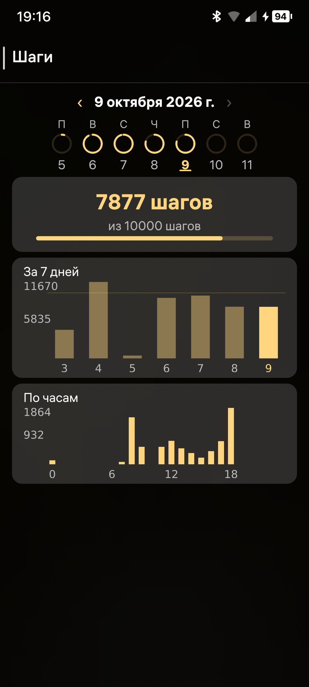
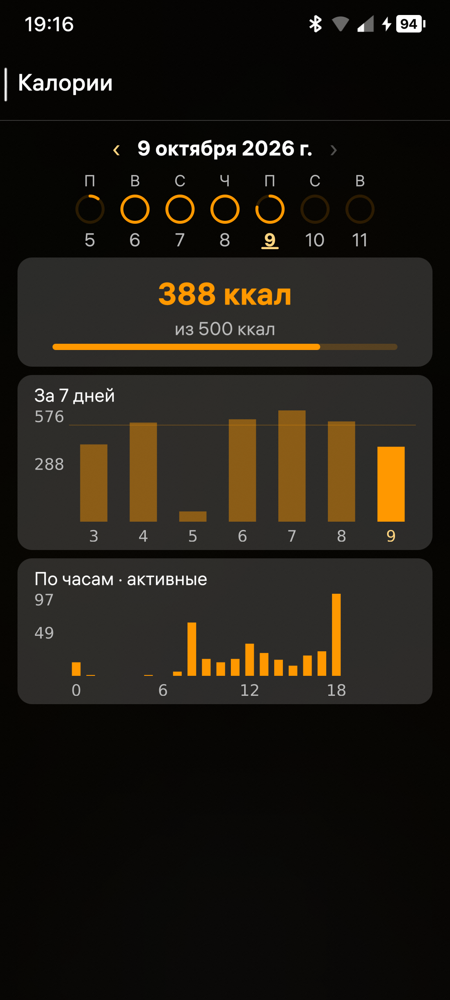
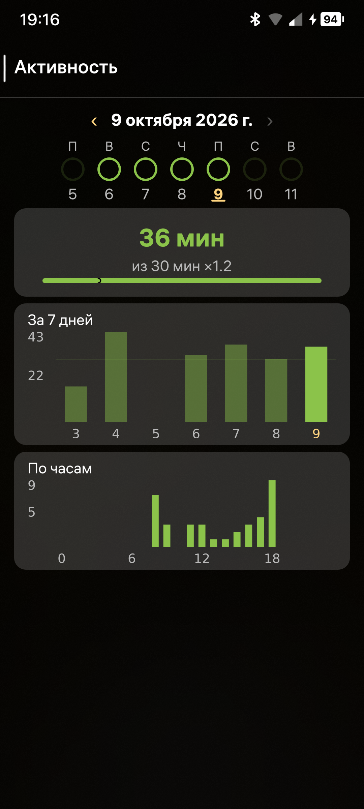
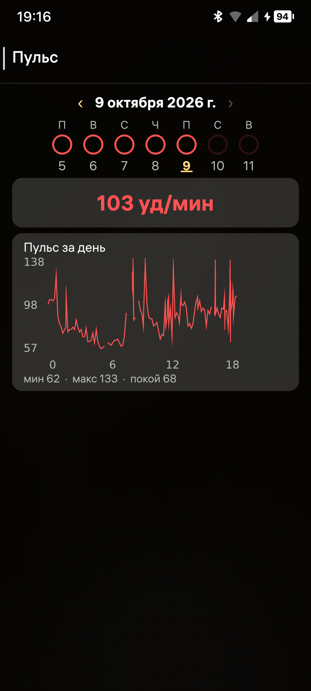
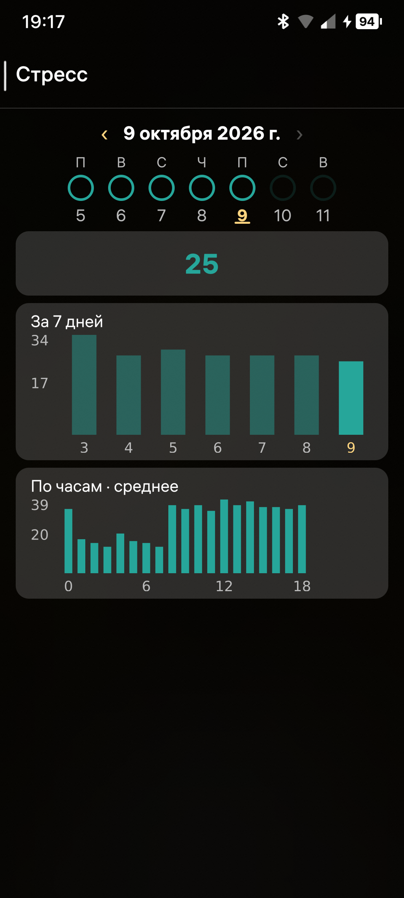
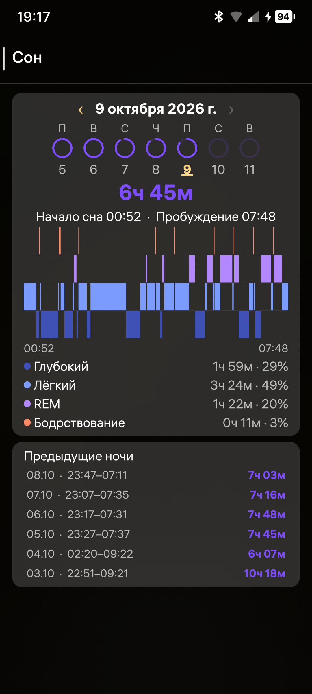
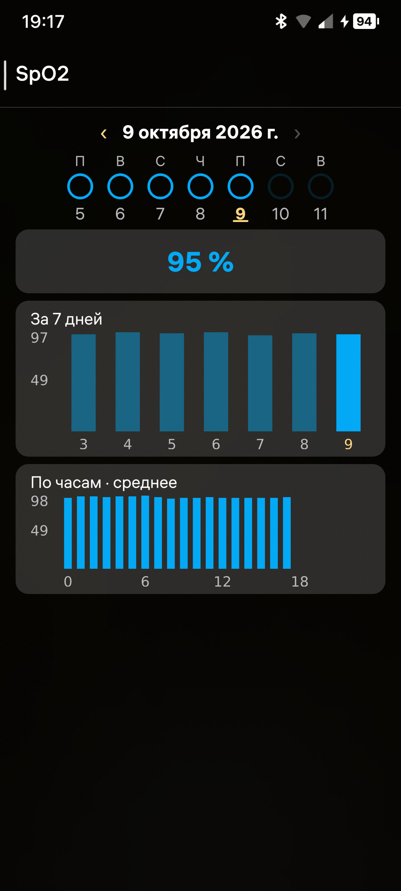
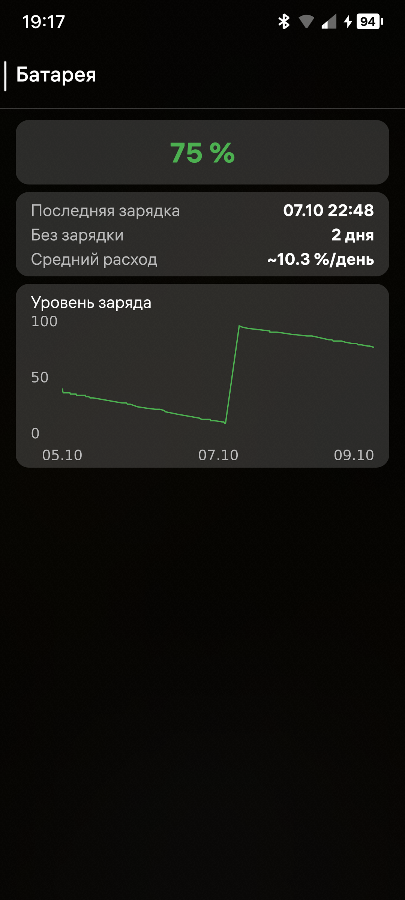

# Аврора Фитнес

Фитнес-приложение для ОС Аврора с поддержкой носимых устройств по Bluetooth Low Energy.
Поддерживаются **Xiaomi Mi Band 8** и **PineTime с InfiniTime** — напрямую через BlueZ.

## Возможности

- Подключение к Mi Band 8 и аутентификация по ключу
- PineTime: шаги, текущий пульс, заряд батареи, уведомления и синхронизация времени
- Управление MPRIS-плеером с PineTime: воспроизведение, пауза, треки, громкость и метаданные
- Статистика на главном экране: шаги, калории, время активности, пульс, сон, стресс, SpO2
- Три кольца активности (как на браслете): шаги / калории / активность с целями
- Цели по шагам, калориям и времени активности, уведомления о достижении цели
- График шагов за 7 дней, фазы сна
- Пересылка уведомлений с телефона на браслет (фоновый демон), с иконками
- Обложка приложения с полосками шагов, калорий и активности
- Автоподключение к браслету при запуске, настройки и БД переживают переустановку
- Синхронизация жестом вниз
- Профиль с ростом и весом, настройка интервала автосинхронизации от 1 до 1440 минут

## Скриншоты

| | | | | |
| --- | --- | --- | --- | --- |
|  |  |  |  |  |
|  |  |  |  |  |

## Получение auth key для Mi Band 8

Для подключения браслета нужен ключ аутентификации (32 hex-символа). Root не требуется.

1. Установите на Android-смартфон фирменное приложение **Mi Fitness**
   (пакет `com.xiaomi.wearable`) и спарьте с ним браслет.
2. Подключите смартфон к ПК по USB (режим передачи файлов) или откройте
   файловый менеджер с доступом к `Android/data`.
3. Откройте файл логов:

   ```
   /sdcard/Android/data/com.xiaomi.wearable/files/log/XiaomiFit.device.log
   ```

   (то же самое, что `Internal storage/Android/data/com.xiaomi.wearable/files/log/…`)
4. Найдите в файле строку с `encryptKey` — следующие за ним 32 hex-символа
   и есть auth key браслета.

С компьютера удобнее через adb:

```sh
adb pull /sdcard/Android/data/com.xiaomi.wearable/files/log/XiaomiFit.device.log
grep -Eo '(encryptKey|authKey|huamiAuthKey)["=: ]+[0-9a-f]{32}' XiaomiFit.device.log
```

Если в свежем файле ключа нет — посмотрите ротированные логи рядом
(`XiaomiFit.device.log.bak.*`, `Transfer.device.log`) или переподключите
браслет в Mi Fitness, чтобы ключ записался в лог заново.

Введите ключ в настройках устройства при первом подключении — дальше он сохраняется,
и повторный ввод не требуется.

## PineTime

Выберите PineTime или InfiniTime в настройках после сканирования. Ключ не нужен.
Поддерживаются текущие шаги, пульс, батарея, установка времени, уведомления
и управление MPRIS-плеером. Для уведомлений включите пересылку в настройках.

Архив активности на часах недоступен: приложение сохраняет полученные показания.
Активность рассчитывается по наблюдаемому приросту шагов, калории — по шагам,
росту и весу (по умолчанию 70 кг / 170 см). Неподдерживаемые показатели скрыты.
Данные разных устройств хранятся отдельно.

## Сборка

Требуется Aurora OS SDK 5.2.1.200, Docker и образ
`aurora-build-tools-nighteugene:5.2.1.200`. Сборка использует Qt **5.6.3**,
выполняется для aarch64, armv7hl и x86_64; на устройство устанавливается aarch64.
RPM подписываются ключом SDK. Проверка профиля regular при сборке отключена:
для автоматической регистрации службы используется разрешение AppLaunch. Это не релизная
подпись разработчика; порядок релизной подписи описан в `AGENTS.md`.

```sh
./build.sh           # сборка RPM
./build.sh --deploy  # сборка и установка на устройство (scp + sdk-deploy-rpm)
```

Адрес устройства задаётся через `DEVICE` (по умолчанию
`defaultuser@192.168.2.15`), путь к SDK — в начале `build.sh`.
Версия и release RPM берутся из spec-файла.
Установка на устройство выполняется только от пользователя `defaultuser`.

```sh
DEVICE=defaultuser@<адрес-устройства> ./build.sh --deploy
```

Перед установкой **отключите «Включить валидацию» в настройках режима
разработчика на устройстве**: для автоматической настройки фоновой службы
приложение запрашивает разрешение AppLaunch («Пользовательские службы»).

Установите RPM и откройте «Фитнес». Если система запросит разрешения
Bluetooth и «Пользовательские службы», подтвердите их. Этот запрос возможен
и после переустановки. Приложение само зарегистрирует службу
и включит её автозапуск. При первом использовании выберите браслет в настройках;
для Mi Band 8 введите ключ аутентификации. При последующих запусках служба
подключается к сохранённому устройству. Терминал, SSH и ручное копирование
файлов не требуются. После обновления откройте приложение один раз: оно
автоматически перезапустит службу с новой версией. `build.sh --deploy`
после установки открывает приложение автоматически.

При переходе с прежней версии ручная служба отключается автоматически.
Новая служба работает после закрытия GUI и настроена на запуск при входе пользователя.

В меню «Профиль» задаются рост и вес. В «Настройках» включается
автосинхронизация и задаётся её интервал в минутах. При выключенной
автосинхронизации поле интервала неактивно. PineTime дополнительно опрашивается
раз в минуту для сохранения текущих показаний; это не загрузка архива активности.

Демон постоянно обслуживает BLE, синхронизацию и D-Bus API. GUI получает
состояние и отправляет команды через `/band`, самостоятельно к BLE не подключается.
Переключатели уведомлений и автосинхронизации меняют только эти функции;
отключение пересылки уведомлений не должно останавливать службу.
CLI `--read`, `--auth`, `--sync`, `--notify` временно забирают владение браслетом.

Настройки, БД и кэш иконок находятся в
`~/.config/ru.nighteugene.aurorafitness/`; БД разных устройств разделены.
Оригиналы файлов Mi Band хранятся рядом, в подкаталоге `activity/`, и входят
в резервную копию этого каталога. При отказе сохранения файл остаётся в очереди
браслета. Неизвестные форматы сохраняются в архив, но не меняют статистику;
такая синхронизация отмечается как неполная.
Ключ Mi Band после сброса и повторной привязки нужно получить и ввести заново.
После удаления приложения служба автоматически завершится примерно за
30–40 секунд; этот интервал позволяет пережить обычную переустановку.

### Проверки

```sh
./tests/run.sh  # protobuf, AES-CCM и безопасные имена иконок; Qt 5.6 + UBSan в Docker
```

Дополнительные проверки сохранности данных:

```sh
./tests/release-audit.sh  # временная БД, без доступа к данным устройства
```

Проверочная версия 1.2.0 проходит оба набора тестов. Исправлены дефекты
сохранности данных, найденные ревизией. Результаты аппаратной проверки
и оставшиеся действия перед публикацией: [ревизия](docs/code-review.md),
[подготовка релиза](docs/release-readiness.md).

## Структура

- `app/` — GUI (Qt 5.6 / QML / Aurora.Controls и Silica) и служба BLE, уведомлений и синхронизации
- `rpm/` — spec-файл
- `tools/` — генератор иконок
- `tests/` — регрессионные проверки в SDK
- `docs/` — ревизии, история релизов и описание регистрации службы
- `AGENTS.md` — технические детали: протокол Mi Band 8, quirks BlueZ, хранение данных

## Автор

Eugene Todoruk (nighteugene)

Приложение создано с помощью ИИ и открыто для доработки: по исходному коду и логам
Mi Fitness его можно адаптировать под другие часы.

## Лицензия

[BSD-3-Clause](LICENSE). Текст лицензии также включён в RPM.
